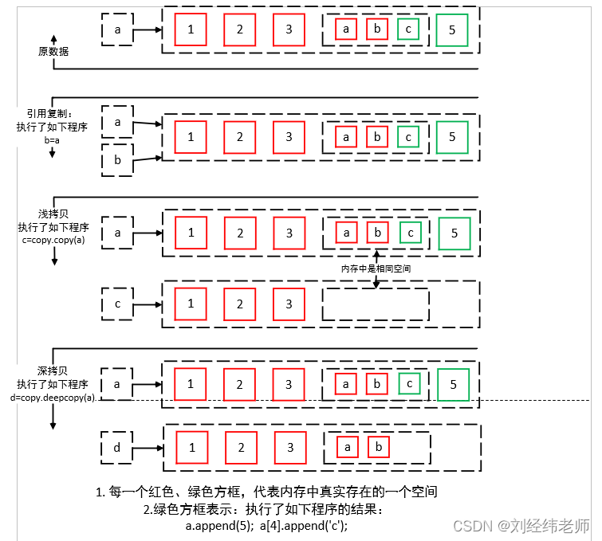

[TOC]

可通过名称来访问其各个值的数据结构。这种数据结构称为映射（mapping）。字典是Python中唯一的内置映射类型，其中的值不按顺序排列，而是存储在键下。键可能是数、字符串或元组。

## 创建和使用字典

字典以类似于下面的方式表示：

```python
phonebook = {'Alice': '2341', 'Beth': '9102', 'Cecil': '3258'}
```

字典由键及其相应的值组成，这种键-值对称为项（item）。在前面的示例中，键为名字，而
值为电话号码。每个键与其值之间都用冒号（ : ）分隔，项之间用逗号分隔，而整个字典放在花
括号内。空字典（没有任何项）用两个花括号表示，类似于下面这样： {} 。

> 在字典中，键是独一无二的，值可以重复

### 直接创建字典

```python
# 创建字典——直接创建
item_dic = {
    "name":"Gumdy",
    "age":32
}

print(item_dic) # {'name': 'Gumdy', 'age': 32}
```


### 使用dict类创建

可使用函数 dict从其他映射（如其他字典）或键-值对序列创建字典。

```python
# 创建字典——从其他序列创建
items = [('name','Gumdy'),('age',32)]
item_dic = dict(items)

print(item_dic) # {'name': 'Gumdy', 'age': 32}
```

还可使用关键字实参数：

```python
# 创建字典——dict+关键字参数
items = dict(name = 'Gumby',age = 32)
item_dic = dict(items)

print(item_dic) # {'name': 'Gumdy', 'age': 32}
```


## 基本的字典操作

- len(d) 返回字典 d 包含的项（键-值对）数。
- d[k] 返回与键 k 相关联的值。
- d[k] = v 将值 v 关联到键 k 。
- del d[k] 删除键为 k 的项。
- k in d 检查字典 d 是否包含键为 k 的项。

```python
# 学生成绩单
student_report = {'Alice': '100', 'Beth': '98', 'Cecil': '54'}

# 字段项长度
print(len(student_report))	# 3

# 返回键为Alice的值
print(student_report['Alice'])	# 100

# 设置键为Cecil的值
student_report['Cecil'] = '87'	# {'Alice': '100', 'Beth': '98', 'Cecil': '87'}
print(student_report)
# 如果键不存在，会创建新项
student_report['Juny'] = '92'	
print(student_report)	# {'Alice': '100', 'Beth': '98', 'Cecil': '87', 'Juny': '92'}

# 删除键为Beth的项
del student_report['Beth']
print(student_report)	# {'Alice': '100', 'Cecil': '87', 'Juny': '92'}

# 判断键是否存在
print('Beth' in student_report)	 # False
print('Juny' in student_report)	# True

```

注意事项

> 键的类型：字典中的键可以是整数，但并非必须是整数。字典中的键可以是任何**不可变**
> **的类型**，如浮点数（实数）、字符串或元组。
> 自动添加：即便是字典中原本没有的键，也可以给它赋值，这将在字典中创建一个新项。


## 将字符串格式设置功能用于字典

可使用 format_map 来指出你将通过一个映射来提供所需的信息。

```python
phonebook = {'Beth': '9102', 'Alice': '2341', 'Cecil': '3258'}

print("Cecil's phone number is {Cecil}.".format_map(phonebook)) # Cecil's phone number is 3258.
```

像这样使用字典时，可指定任意数量的转换说明符，条件是所有的字段名都是包含在字典中的键。在模板系统中，这种字符串格式设置方式很有用（下面的示例使用的是HTML）:

```python
template = '''
<head><title>{title}</title></head>
<body>
    <h1>{title}</h1>
    <p>{text}</p>
</body>
'''
data = {'title': 'My Home Page', 'text': 'Welcome to my home page!'}

print(template.format_map(data))

"""
<head><title>My Home Page</title></head>
<body>
    <h1>My Home Page</h1>
    <p>Welcome to my home page!</p>
</body>
"""
```

## 字典常用方法

### clear

使用clear() 清除字典所有项。

```python
# clear 
student_report = {
    'Alice': 100,
    'Beth': 100, 
    'Gumy': 89, 
    'Cecil': 98
    }

student_report.clear()

print(student_report) # {}
```

### copy

方法 copy 返回一个新字典，其包含的键-值对与原来的字典相同（这个方法执行的是浅复制，
因为值本身是原件，而非副本）。

```python
# copy
x = {'username': 'admin', 'machines': ['foo', 'bar', 'baz']}

y = x.copy()

y['username'] = 'mlh'
y['machines'].remove('bar')

print(y)
print(x)
# {'username': 'mlh', 'machines': ['foo', 'baz']}
# {'username': 'admin', 'machines': ['foo', 'baz']}
```

如上所见，当替换副本中的值时，原件不受影响。然而，如果修改副本中的值（就地修改而不是替换），原件也将发生变化，因为原件指向的也是被修改的值（如这个示例中的’machines’列表所示）。


为避免这种问题，一种办法是执行深复制，即同时复制值及其包含的所有值，等等。为此，可使用模块copy中的函数deepcopy。

```python
from copy import deepcopy 
d = {} 
d['names'] = ['Alfred', 'Bertrand'] 
c = d.copy() 
dc = deepcopy(d) 
d['names'].append('Clive') 
print(c)	# {'names': ['Alfred', 'Bertrand', 'Clive']} 
print(dc)	# {'names': ['Alfred', 'Bertrand']}
```

引用、浅拷贝、深拷贝原理对比（[原文](https://blog.csdn.net/liujingwei8610/article/details/122519256)）




### fromkeys

方法 fromkeys 创建一个新字典，其中包含指定的键，且每个键对应的值都是 None 。
```python
>>> {}.fromkeys(['name', 'age'])
>>> {'age': None, 'name': None}
```
这个示例首先创建了一个空字典，再对其调用方法 fromkeys 来创建另一个字典，这显得有点多余。你可以不这样做，而是直接对 dict调用方法 fromkeys 。
```python
>>> dict.fromkeys(['name', 'age'])
>>> {'age': None, 'name': None}
```
如果你不想使用默认值 None ，可提供特定的值。
```python
>>> dict.fromkeys(['name', 'age'], '(unknown)')
>>> {'age': '(unknown)', 'name': '(unknown)'}
```
### get

方法 get 为访问字典项提供了宽松的环境。

通常，如果你试图访问字典中没有的项，将引发错误。

```python
>>> d = {}
>>> print(d['name'])
Traceback (most recent call last):
File "<stdin>", line 1, in ?
KeyError: 'name'
```

使用 get 来访问不存在的键时，没有引发异常，而是返回 None 。

```python
>>> print(d.get('name'))
None
```

你可指定默认值，这样将返回你指定的值而不是 None 。

```python
>>> d.get('name', 'N/A')
'N/A'
```

如果字典包含指定的键， get 的作用将与普通字典查找相同。
```python
>>> d['name'] = 'Eric'
>>> d.get('name')
'Eric'
```

### items

方法 items 返回一个包含所有字典项的列表，其中每个元素都为 (key, value) 的形式。字典项在列表中的排列顺序不确定。

```python
d = {'title': 'Python Web Site', 'url': 'http://www.python.org', 'spam': 0,'dic':{'name':'li','age':32}}
dict_items = d.items()
print(dict_items)
```

输出：

```
dict_items([('title', 'Python Web Site'), ('url', 'http://www.python.org'), ('spam', 0), ('dic', {'name': 'li', 'age': 32})])
```

返回值属于一种名为字典视图的特殊类型。字典视图可用于迭代。

### keys
方法 keys 返回一个字典视图，其中包含指定字典中的键。 
```python
student_report = {'Alice': 100, 'Beth': 98, 'Cecil': 54}

keys = student_report.keys()
print(keys)
# dict_keys(['Alice', 'Beth', 'Cecil'])
```

### values

方法 values 返回一个由字典中的值组成的字典视图

```python
student_report = {'Alice': 100, 'Beth': 98, 'Cecil': 54}

values = student_report.values()
print(values)
# dict_values([100, 98, 54])
```

### pop

方法 pop 可用于获取与指定键相关联的值，并将该键-值对从字典中删除。

```python
student_report = {'Alice': 100, 'Beth': 98, 'Cecil': 54}

student_report.pop('Alice')
print(student_report) 
# {'Beth': 98, 'Cecil': 54}
```

### popitem 

方法 popitem 类似于 list.pop ，但 list.pop 弹出列表中的最后一个元素，而 popitem 随机地弹
出一个字典项，因为字典项的顺序是不确定的，没有“最后一个元素”的概念。

```python
student_report = {'Alice': 100, 'Beth': 98, 'Cecil': 54}

i = student_report.popitem()
print(i)	# ('Cecil', 54)
print(student_report) # {'Alice': 100, 'Beth': 98}
```

### setdefault 

方法 setdefault 有点像 get ，因为它也获取与指定键相关联的值，但除此之外， setdefault 还在字典不包含指定的键时，在字典中添加指定的键-值对。

```python
>>> d = {}
>>> d.setdefault('name', 'N/A')
'N/A'
>>> d
{'name': 'N/A'}
>>> d['name'] = 'Gumby'
>>> d.setdefault('name', 'N/A')
'Gumby'
>>> d
{'name': 'Gumby'}
```

如果指定的键存在，就返回其值，并保持字典不变。与 get 一样，值是可选的；如果没有指定，默认为 None 。

```python
>>> d = {}
>>> print(d.setdefault('name'))
None
>>> d
{'name': None}
```

### update

方法 update 使用一个字典中的项来更新另一个字典。

```python
d = {'title': 'Python Web Site','url': 'http://www.python.org','changed': 'Mar 14 22:09:15 MET 2016'}
x = {'title': 'Python Language Website','date':'2022-6-10'}
d.update(x)

print(d)
# {'title': 'Python Language Website', 'url': 'http://www.python.org', 'changed': 'Mar 14 22:09:15 MET 2016', 'date': '2022-6-10'}
```

对于通过参数提供的字典，将其项添加到当前字典中。如果当前字典包含键相同的项，就替换它。


