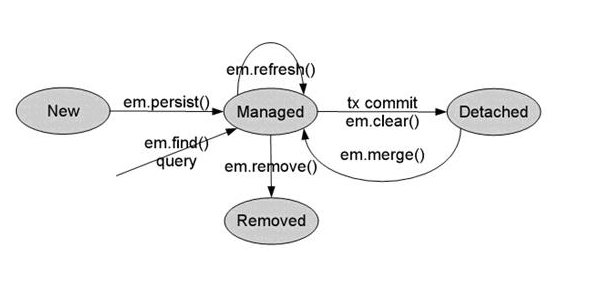

## ORM了解

### ORM概述

ORM（Object-Relational Mapping） 表示对象关系映射。在面向对象的软件开发中，通过ORM，就可以把对象映射到关系型数据库中。只要有一套程序能够做到建立对象与数据库的关联，操作对象就可以直接操作数据库数据，就可以说这套程序实现了ORM对象关系映射


简单的说：ORM就是建立实体类和数据库表之间的关系，从而达到操作实体类就相当于操作数据库表的目的。

### 为什么使用ORM

当实现一个应用程序时（不使用O/R Mapping），我们可能会写特别多数据访问层的代码，从数据库保存数据、修改数据、删除数据，而这些代码都是重复的。而使用ORM则会大大减少重复性代码。对象关系映射（Object Relational Mapping，简称ORM），主要实现程序对象到关系数据库数据的映射。

### 常见ORM框架

常见的ORM框架：Mybatis（ibatis）、Hibernate

## Hibernate 与 JPA

### Hibernate 概述

Hibernate是一个开放源代码的对象关系映射框架，它对JDBC进行了非常轻量级的对象封装，它将POJO与数据库表建立映射关系，是一个全自动的orm框架。

Hibernate可以自动生成SQL语句，自动执行，使得Java程序员可以随心所欲的使用对象编程思维来操纵数据库。

### JPA概述

JPA的全称是Java Persistence API， 即Java 持久化API，是SUN公司推出的一套基于ORM的规范，内部是由一系列的接口和抽象类构成。


JPA通过JDK 5.0注解或XML描述对象－关系表的映射关系，并将运行期的实体对象持久化到数据库中。


Sun引入新的JPA ORM规范出于两个原因：其一，简化现有Java EE和Java SE应用开发工作；其二，Sun希望整合ORM技术，实现天下归一。

[百度百科-JPA](https://baike.baidu.com/item/JPA/5660672?fr=aladdin)

### JPA优势

**1. 标准化**

  JPA 是 JCP 组织发布的 Java EE 标准之一，因此任何声称符合 JPA 标准的框架都遵循同样的架构，提供相同的访问API，这保证了基于JPA开发的企业应用能够经过少量的修改就能够在不同的JPA框架下运行。

 

**2. 容器级特性的支持**

  JPA框架中支持大数据集、事务、并发等容器级事务，这使得 JPA 超越了简单持久化框架的局限，在企业应用发挥更大的作用。

 

**3. 简单方便**

  JPA的主要目标之一就是提供更加简单的编程模型：在JPA框架下创建实体和创建Java 类一样简单，没有任何的约束和限制，只需要使用 javax.persistence.Entity进行注释，JPA的框架和接口也都非常简单，没有太多特别的规则和设计模式的要求，开发者可以很容易的掌握。JPA基于非侵入式原则设计，因此可以很容易的和其它框架或者容器集成

 

**4. 查询能力**

  JPA的查询语言是面向对象而非面向数据库的，它以面向对象的自然语法构造查询语句，可以看成是Hibernate HQL的等价物。JPA定义了独特的JPQL（Java Persistence Query Language），JPQL是EJB QL的一种扩展，它是针对实体的一种查询语言，操作对象是实体，而不是关系数据库的表，而且能够支持批量更新和修改、JOIN、GROUP BY、HAVING 等通常只有 SQL 才能够提供的高级查询特性，甚至还能够支持子查询。

 

**5. 高级特性**

  JPA 中能够支持面向对象的高级特性，如类之间的继承、多态和类之间的复杂关系，这样的支持能够让开发者最大限度的使用面向对象的模型设计企业应用，而不需要自行处理这些特性在关系数据库的持久化。

### JPA与hibernate的关系

JPA规范本质上就是一种ORM规范，注意不是ORM框架——因为JPA并未提供ORM实现，它只是制订了一些规范，提供了一些编程的API接口，但具体实现则由服务厂商来提供实现。 


JPA和Hibernate的关系就像JDBC和JDBC驱动的关系，JPA是规范，Hibernate除了作为ORM框架之外，它也是一种JPA实现。JPA怎么取代Hibernate呢？JDBC规范可以驱动底层数据库吗？答案是否定的，也就是说，如果使用JPA规范进行数据库操作，底层需要hibernate作为其实现类完成数据持久化工作。


## JPA的理解

JPA的总体思想和现有hibernate、TopLink，JDO等ORM框架大体一致。总的来说，JPA包括以下3方面的技术：

1. ORM映射元数据，JPA支持XML和JDK 5.0注解两种元数据的形式，元数据描述对象和表之间的映射关系，框架据此将实体对象持久化到数据库表中；
2. JPA的API，用来操作实体对象，执行CRUD操作，框架在后台替我们完成所有的事情，开发者从繁琐的JDBC和SQL代码中解脱出来。
3. 查询语言JPQL，这是持久化操作中很重要的一个方面，通过面向对象而非面向数据库的查询语言查询数据，避免程序的SQL语句紧密耦合。

## JPA 实体生命周期理解

jpa 实体生命周期有四种状态


- New：瞬时对象，尚未有id，还未和Persistence Context建立关联的对象。

- Managed：持久化受管对象，有id值，已经和Persistence Context建立了关联的对象。

- Datached：游离态离线对象，有id值，但没有和Persistence Context建立关联的对象。

- Removed：删除的对象，有id值，尚且和Persistence Context有关联，但是已经准备好从数据库中删除

  

Managed状态下的数据保存，更新以及删除数据下的Removed状态，数据都不会立即更新到数据库，只有当你事务提交或者em.flush()，才会立即更新到数据库。

Datached的状态，可以调用em.merge()方法，这个方法会根据实体类的id来更新数据库数据，这时实体类变成了Managed状态。

四种状态总结：

| 状态名 | 作为java对象存在 | 在实体管理器中存在 | 在数据库存在 |
| ------ | ---------------- | ------------------ | ------------ |
| New    | yes|     no |  no |
|Managed|yes|yes|no|
|Datached|no|no|no|
|Removed|yes|yes|no|

```java
@Transactional
public void save(){
 
    //New 状态
    Task t = new Task();
    t.setTaskName("task" + new Date().getTime());
    t.setCreateTime(new Date());
 
    //Managed状态
    em.persist(t); //实体类t已经有id t.getId();
    t.setTaskName("kkk");  //更新任务名称，这时，如果提交事务，则直接将kkk更新到数据库
 
    //Detached状态 事务提交或者调用em.clear都直接将实体任务状态变为Detached
    em.clear();
    t.setTaskName("kkk"); //更新数据不会更新到数据库
 
    //Removed状态
    em.remove(t);
}
```


## JPA 实体管理器

实体管理器（EntityManager）用于管理系统中的实体，它是实体与数据库之间的桥梁，通过调用实体管理器的相关方法可以把实体持久化到数据库中，同时也可以把数据库中的记录打包成实体对象。


## JPA的persistence.xml文件

persistence.xml 是JPA的持久化配置文件，用来映射PU(Persist Unit)的。作用是映射表和类，里面也可以配置数据库连接信息

 https://www.cnblogs.com/luxh/archive/2012/05/24/2516282.html

https://www.cnblogs.com/116970u/p/11584418.html

```
注意:配置参数hibernate.hbm2ddl.auto 各个取值的含义

validate  update  create  create-drop

  这几个参数的作用主要用于：自动创建  更新  验证数据库表结构

  如果不是此方面的需求取none

  validate：加载hibernate时，验证创建数据库表结构

  create：每次加载hibernate，重新创建数据库表结构，这就是导致数据库表结构丢失的原因

  create-drop：加载hibernate时创建，退出是删除表结构

  update：加载hibernate自动更新数据库结构
```


## JPA实体与数据库映射

当将 Java bean 字段映射到数据库列时，我们可以选择标记字段，标记 getter 方法或标记两者。


- @Entity 

  - 作用：指定当前类是实体类。
- @Table

  - 作用：指定实体类和表之间的对应关系。
  - 属性：
    - name：指定数据库表的名称
- @Id

  - 作用：指定当前字段是主键。
-  @GeneratedValue

  - 作用：指定主键的生成方式。
  - 属性：

    - strategy ：指定主键生成策略。
- @Column
  - 作用：指定实体类属性和数据库表之间的对应关系
  - 属性：
    - name：指定数据库表的列名称。
    - unique：是否唯一
    - nullable：是否可以为空 
    - inserttable：是否可以插入
    - updateable：是否可以更新
    - columnDefinition: 定义建表时创建此列的DDL
    - secondaryTable: 从表名。如果此列不建在主表上（默认建在主表），该属性定义该列所在从表的名字。

## JPA 主键生成策略

### GeneratorValue 

为一个实体类生成一个唯一标识的主键(JPA要求每一个实体Entity,必须有且只有一个主键)。它有两个属性，分别是strategy 和 generator。

```java
@Target({ElementType.METHOD, ElementType.FIELD})
@Retention(RetentionPolicy.RUNTIME)
public @interface GeneratedValue {
    GenerationType strategy() default GenerationType.AUTO;

    String generator() default "";
}
```

#### strategy

一共有四种，被定义在枚举类GenerationType中，包括：TABLE, SEQUENCE, IDENTITY 和AUTO。

```java
public enum GenerationType {
    TABLE,	// JPA提供的一种机制，通过一张数据库表的形式帮助我们完成主键自增
    SEQUENCE, // 序列。根据底层数据库的序列来生成主键,底层数据库必须支持序列
    IDENTITY, // 自增。主键由数据库自动生成（主要是自动增长型）,底层数据库必须支持自动增长方式（MySQL）
    AUTO;	// 由程序自动控制、程序自动帮我们选择主键生成策略(默认)

    private GenerationType() {
    }
}
```

- GenerationType.TABLE：使用一个特定的数据库表格来保存主键,持久化引擎通过关系数据库的一张特定的表格来生成主键,这种策略的好处就是不依赖于外部环境和数据库的具体实现,在不同数据库间可以很容易的进行移植,但由于其不能充分利用数据库的特性,所以不会优先使用。该策略一般与另外一个注解一起使用@TableGenerator,@TableGenerator注解指定了生成主键的表(可以在实体类上指定也可以在主键字段或属性上指定),然后JPA将会根据注解内容自动生成一张表作为序列表(或使用现有的序列表)。如果不指定序列表,则会生成一张默认的序列表,表中的列名也是自动生成,数据库上会生成一张名为sequence的表(SEQ_NAME,SEQ_COUNT)。序列表一般只包含两个字段:第一个字段是该生成策略的名称,第二个字段是该关系表的最大序号,它会随着数据的插入逐渐累加。例如：

```java
@Id  
@GeneratedValue(strategy = GenerationType.TABLE, generator = "id_sequence")  
@TableGenerator(name = "id_sequence", allocationSize = 1, table = "sequence_table", pkColumnName = "sequence_max_id", valueColumnName = "sequence_count")  
private int id;
```

GenerationType.SEQUENCE：在某些数据库中,不支持主键自增长,比如Oracle,其提供了一种叫做"序列(sequence)"的机制生成主键。此时,GenerationType.SEQUENCE就可以作为主键生成策略。该策略的不足之处正好与TABLE相反,由于只有部分数据库(Oracle,PostgreSQL,DB2)支持序列对象,所以该策略一般不应用于其他数据库。类似的,该策略一般与另外一个注解一起使用@SequenceGenerator,@SequenceGenerator注解指定了生成主键的序列.然后JPA会根据注解内容创建一个序列(或使用一个现有的序列)。如果不指定序列,则会自动生成一个序列SEQ_GEN_SEQUENCE。例如：

```java
@Id  
@GeneratedValue(strategy = GenerationType.SEQUENCE, generator = "id_sequence")  
@SequenceGenerator(name = "id_sequence", initialValue = 1, allocationSize = 1, sequenceName = "ID_SEQUENCE")  
private int id;
```

GenerationType.IDENTITY：此种主键生成策略就是通常所说的主键自增长,数据库在插入数据时,会自动给主键赋值,比如MYSQL可以在创建表时声明"auto_increment" 来指定主键自增长。该策略在大部分数据库中都提供了支持(指定方法或关键字可能不同),但还是有少数数据库不支持,所以可移植性略差。使用自增长主键生成策略是只需要声明strategy = GenerationType.IDENTITY即可。例如：

```java
@Id  
@GeneratedValue(strategy = GenerationType.IDENTITY)  
private int id;
```

GenerationType.AUTO：把主键生成策略交给持久化引擎(persistence engine),持久化引擎会根据数据库在以上三种主键生成策略中选择其中一种。此种主键生成策略比较常用,由于JPA默认的生成策略就是GenerationType.AUTO,所以使用此种策略时.可以显式的指定@GeneratedValue(strategy = GenerationType.AUTO)也可以直接@GeneratedValue。例如：

```java
@Id
@GeneratedValue(strategy = GenerationType.AUTO)  
private int id;
```

#### generator

默认为空字符串，它定义了主键生成器的名称，可以配合生成器来使用。示例：

```java
@GeneratedValue(generator="system-uuid")//关联system-uuid
@GenericGenerator(name="system-uuid", strategy = "uuid")
```

### GenericGenerator

 是Hibernate提供的自定义主键策略生成器，它需要和**@GeneratedValue**一起使用，并且它的name属性要和@GeneratedValue中的generator名称要一致。

@GenericGenerator支持13种策略，分别是：

```java
static {

  GENERATORS.put("uuid", UUIDHexGenerator.class);

  GENERATORS.put("hilo", TableHiLoGenerator.class);

  GENERATORS.put("assigned", Assigned.class);

  GENERATORS.put("identity", IdentityGenerator.class);

  GENERATORS.put("select", SelectGenerator.class);

  GENERATORS.put("sequence", SequenceGenerator.class);

  GENERATORS.put("seqhilo", SequenceHiLoGenerator.class);

  GENERATORS.put("increment", IncrementGenerator.class);

  GENERATORS.put("foreign", ForeignGenerator.class);

  GENERATORS.put("guid", GUIDGenerator.class);

  GENERATORS.put("uuid.hex", UUIDHexGenerator.class); //uuid.hex is deprecated

  GENERATORS.put("sequence-identity", SequenceIdentityGenerator.class);

}
```

上面的12种策略，再加上native，一共是13种。其实，这就是hibernate对JPA策略的一种拓展补充。举个例子：

```java
@GeneratedValue(generator = "paymentableGenerator") 
@GenericGenerator(name = "paymentableGenerator", strategy = "uuid")
private int id;
```

它会根据内部程序计算出32位长度的唯一id。

### 自定义ID生成器

在使用的 JPA 的时候，通常会在实体类里面为主键 id 配置 id 的生成策略，比如下面这样的，生成 UUID 作为主键

```java
@Id
@GeneratedValue(generator="sys_uid")
@GenericGenerator()
private String id;
```

#### 场景一：自定义ID前缀

**场景**

有时候不能完全满足我们的需要。我们需要一个自定义的 id，比如：  

用户表 id

```
USER-f14c1663ba4c4317b6b6b8857d31c915
```

角色表 id

```
ROLE-f14c1663ba4c4317b6b6b8857d31c915
```

**实现**

首先需要写一个类实现`Configurable`和`IdentifierGenerator`

```java
import java.io.Serializable;
import java.util.Properties;
import java.util.UUID;

import org.hibernate.HibernateException;
import org.hibernate.MappingException;
import org.hibernate.engine.spi.SharedSessionContractImplementor;
import org.hibernate.id.Configurable;
import org.hibernate.id.IdentifierGenerator;
import org.hibernate.service.ServiceRegistry;
import org.hibernate.type.Type;

/**
 * 	自定义id生成
 * @author hll
 *
 */
public class CustomGenerationId implements Configurable,IdentifierGenerator {
	
	/**
	 * id前缀
	 */
	private String idPrefix;
	
	public CustomGenerationId() {};

	@Override
	public Serializable generate(SharedSessionContractImplementor session, Object object) throws HibernateException {
		// TODO Auto-generated method stub
		return getId();
	}

	@Override
	public void configure(Type type, Properties params, ServiceRegistry serviceRegistry) throws MappingException {
		// TODO Auto-generated method stub
		this.idPrefix = params.getProperty("idPrefix"); //	实体类中@Parameter注解，根据键值获取value
	}
	
	/**
	 * 	该方法需要是线程安全的
	 * @return
	 */
	public String getId() {
		synchronized (CustomGenerationId.class) {
			String uuid = UUID.randomUUID().toString().replace("-", "");
			return idPrefix + "-" + uuid;
		}
	}
}

```

实体类

```java
import java.io.Serializable;

import javax.persistence.Entity;
import javax.persistence.GeneratedValue;
import javax.persistence.Id;
import javax.persistence.Table;

import org.hibernate.annotations.GenericGenerator;
import org.hibernate.annotations.Parameter;

@Entity
@Table()
public class User implements Serializable {

	@Id
	@GeneratedValue(generator="customGenerationId")
	@GenericGenerator(parameters = {@Parameter()} )
	private String id;
		
	//省略....
}


```

原文地址：https://blog.csdn.net/sinat_33151213/article/details/91979121

#### 场景二：实现保存时允许自定义ID

**场景**

我们都知道，使用`save`方法保存实体的时候JAP会根据主键判断是新增(主键为空或者数据库表中无该主键)还是更新(数据库表中有该主键)。

而且，在使用这种如上配置的时候无论实体的主键是否为空，只要在表中不存在，都会再次生成主键，也就是没办法通过给`id`属性赋值的形式来自定义实体的id。

而在一些场景下，会有自定义主键的需求，比如主键来源于其他第三方系统，这时候我们期望的还是使用第三方系统的主键作为主键以表示同一条数据，这就需要我们能够实现自定义主键生成策略，并且JPA也提供了这样的通道。

**实现**

根据需求，可以通过继承`org.hibernate.id.UUIDGenerator`生成器来实现自定义ID：

```java
/**
 * 自定义UUID生成器
 * @author sevenlin
 */
public class CustomUUIDGenerator extends UUIDGenerator {
    @Override
    public Serializable generate(SessionImplementor session, Object object) throws HibernateException {
        Object id = FieldUtil.readField(object, "id");
        if (id != null) {
            return (Serializable) id;
        }
        return super.generate(session, object);
    }
}
```

有了自定义主键生成器之后就可以通过如下配置指定该生成器：

```java
@Id
@GeneratedValue(strategy = GenerationType.AUTO, generator = "custom-uuid")
@GenericGenerator(name = "custom-uuid", strategy = "com.sevenlin.dal.CustomUUIDGenerator")
private String id;
```

这样，就可以实现自定义ID，同时保留原来的主键生成策略不变。

原文地址：https://www.jianshu.com/p/db5f10b546df

## JPA列

### JPA Transient

如果我们不想将属性保存到数据库，我们可以使用@Transient注释标记该字段。

```java
import java.util.Locale;

import javax.persistence.Entity;
import javax.persistence.Id;
import javax.persistence.Transient;

@Entity
@Table(name="professor")
public class Professor {
  @Id
  private int id;
  private String name;
  private long salary;
    
  /**
  * 表名该字段与数据库字段无映射关系
  */
  @Transient 
  private String convertedName;

  public int getId() {
      return id;
  }
  
  public void setId(int id) {
      this.id = id;
  }
  
  public String getName() {
      return name;
  }
  
  public void setName(String name) {
      this.name = name;
      convertedName = convertName(name);
  }

  public long getSalary() {
      return salary;
  }

  public void setSalary(long salary) {
      this.salary = salary;
  }

  public String getConvertedName() {
      return convertedName;
  }

  public String toString() {
      return "Employee " + " id: " + getId() + " name: " + getName() + " converted name: " + getConvertedName() + " salary: " + getSalary();
  }

  protected String convertName(String name) {
      // Convert to upper case Canadian...
      return name.toUpperCase(Locale.CANADA);
  }
}
```

