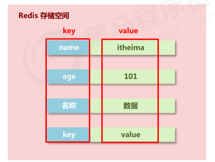
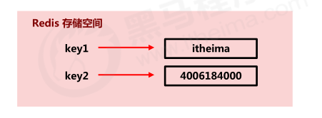
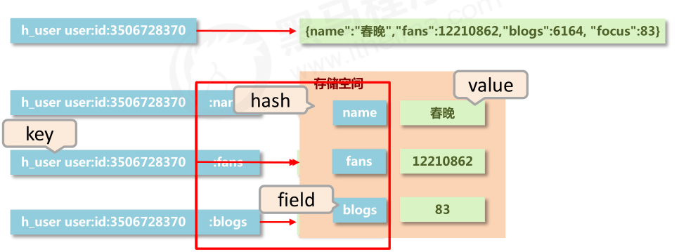
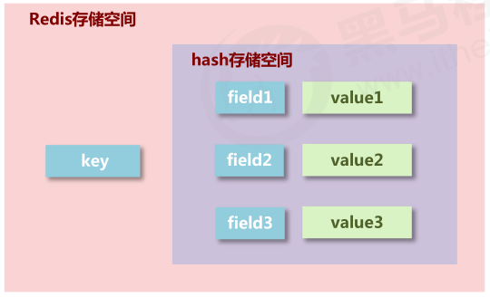

[TOC]


# Redis 基本介绍

在项目中对数据的访问往往都是直接访问数据库的方式，但如果对数据的访问量很大或者访问很频繁的话，将会对数据库来很大的压力，甚至造成数据库崩溃。为了解决这类问题 redis 数据库脱颖而出，redis 数据库出现时是以非关系数据库的光环展示在广大程序猿的面前的，后来 redis 的迭代版本支持了缓存数据、登录 session 状态（分布式 session 共享）等。所以又被作为内存缓存的形式应用到大型企业级项目中。

Redis 是完全开源免费的，遵守 BSD 协议，是一个高性能的 key-value 非关系性数据库 (NoSql)。

Redis 与其他 key - value 缓存产品有以下三个特点：

- Redis 支持数据的持久化，可以将内存中的数据保存在磁盘中，重启的时候可以再次加载进行使用。
- Redis 不仅仅支持简单的 key-value 类型的数据，同时还提供 list，set，zset，hash 等数据结构的存储。
- Redis 支持数据的备份，即 master-slave 模式的数据备份


# Redis 安装

## windows环境

- https://www.runoob.com/redis/redis-install.html

​	

启用Redis:

- Redis服务器运行命令：Redis安装目录/redis-server.exe
- Redis客户端运行命令：Redis安装目录/redis

## Linux环境安装
- https://www.runoob.com/redis/redis-install.html

## docker环境安装
- https://cloud.tencent.com/developer/article/1670205

# Redis中键的操作
Redis 自身是一个 Map，其中所有的数据都是采用 key : value 的形式存储。

数据类型指的是存储的数据的类型，也就是 value 部分的类型，key 部分永远都是字符串。



## 删除指定key

```powershell
del key1 key2 ...
```

返回实际删除key的数量，如果所有的key都不存在，则返回0

示例：


## 判断指定key是否存在

```powershell
exists key
```

判断key是否存在，存在返回1，不存在返回0


## 给指定key重命名

```powershell
rename key newkey
```

作用: 给key赋一个新的key名

返回：修改成功，将返回OK

注:如果newkey已存在,则newkey的原值被覆盖;原来的key将不存在


```powershell
renamenx key newkey  
```

作用: 把key改名为newkey

返回: 发生修改返回1,未发生修改返回0

注: nx--> not exists, 即, newkey不存在时,作改名动作


## 获取key的类型

```powershell
type key

# 返回key存储的值的类型 有string,link,set,order set, hash,none(表示key不存在)
```


## 查询符合条件的key

```powershell
keys pattern
```

pattern：查询模式规则

查询模式规则：

- \* 匹配任意数量的任意符号
- ? 配合一个任意符号
- [] 匹配一个指定符号

示例

```
key *  # 查询所有
keys it* # 查询所有以it开头的
keys *it # 查询所有以it结尾的
keys ??it # 查询所有前面两个字符任意，后面以it结尾的
keys it? # 查询所有以it开头,最后一个字符
keys u[st]er # 查询所有以u开头,以er结尾，中间包含一个字母，s或t
```


# Redis基本数据类型

参考文档：

- 菜鸟教程-Redis https://www.runoob.com/redis/redis-tutorial.html


Redis 可以存储键与 5 种不同数据结构类型之间的映射，这 5 种数据结构类型分别为 String（字符串）、List（列表）、Set（集合）、Hash（散列）和 Zset（有序集合）。

| 类型                 | 简介                                                   | 特性                                                         | 场景                                                         |
| :------------------- | :----------------------------------------------------- | :----------------------------------------------------------- | :----------------------------------------------------------- |
| String(字符串)       | 二进制安全                                             | 可以包含任何数据,比如jpg图片或者序列化的对象,一个键最大能存储512M | ---                                                          |
| Hash(字典)           | 键值对集合,即编程语言中的Map类型                       | 适合存储对象,并且可以像数据库中update一个属性一样只修改某一项属性值(Memcached中需要取出整个字符串反序列化成对象修改完再序列化存回去) | 存储、读取、修改用户属性                                     |
| List(列表)           | 链表(双向链表)                                         | 增删快,提供了操作某一段元素的API                             | 1,最新消息排行等功能(比如朋友圈的时间线) 2,消息队列          |
| Set(集合)            | 哈希表实现,元素不重复                                  | 1、添加、删除,查找的复杂度都是O(1) 2、为集合提供了求交集、并集、差集等操作 | 1、共同好友 2、利用唯一性,统计访问网站的所有独立ip 3、好友推荐时,根据tag求交集,大于某个阈值就可以推荐 |
| Sorted Set(有序集合) | 将Set中的元素增加一个权重参数score,元素按score有序排列 | 数据插入集合时,已经进行天然排序                              | 1、排行榜 2、带权重的消息队列                                |


## string

### 简介

- 存储的数据：单个数据，最简单的数据存储类型，也是最常用的数据存储类型
- 存储数据的格式：一个存储空间保存一个数据
- 存储内容：通常使用字符串，**如果字符串以整数的形式展示，可以作为数字操作使用**

### 存储结构



### 常用命令

| 操作                            | 作用                                                     |
| ------------------------------- | -------------------------------------------------------- |
| set key value                   | 添加/修改数据                                            |
| get key                         | 获取数据                                                 |
| del key                         | 删除数据                                                 |
| mset key1 value1 key2 value2... | 添加/修改多个数据                                        |
| mget key1 key2 key3...          | 获取多个数据                                             |
| strlen key                      | 获取数据字符个数（字符串长度）                           |
| append key value                | 追加信息到原始信息后端(如果原始数据存在就追加，否则新建) |

#### 增加、修改数据

```powershell
SET key value [EX seconds] [PX milliseconds] [NX|XX]
```

说明：

- 如果key 已经存在，SET 将会覆盖旧值
- 当SET 命令对key 设置生存时间（TTL）,该key原有的TTL将会消除

可选参数：

- `EX seconds` ： 将键的过期时间设置为 `seconds` 秒。 执行 `SET key value EX seconds` 的效果等同于执行 `SETEX key seconds value` 。
- `PX milliseconds` ： 将键的过期时间设置为 `milliseconds` 毫秒。 执行 `SET key value PX milliseconds` 的效果等同于执行 `PSETEX key milliseconds value` 。
- `NX` ： 只在键不存在时， 才对键进行设置操作。 执行 `SET key value NX` 的效果等同于执行 `SETNX key value` 。
- `XX` ： 只在键已经存在时， 才对键进行设置操作。

测试

（1）对不存在的key设值：

```powershell
127.0.0.1:6379> set k1 v11
OK
127.0.0.1:6379> get k1
"v11"
127.0.0.1:6379>
```

（2）对已存在的键进行设值：

```powershell
127.0.0.1:6379> set k1 v22
OK
127.0.0.1:6379> get k1
"v22"
127.0.0.1:6379>
```

（3）使用EX 设置生存时间：

```powershell
127.0.0.1:6379> set k1 v111 ex 200
OK
127.0.0.1:6379> ttl k1
(integer) 195
127.0.0.1:6379> ttl k1
(integer) 182
127.0.0.1:6379> ttl k1
(integer) 178
127.0.0.1:6379>
```

（4）使用PX 设置生存时间：

```powershell
127.0.0.1:6379> set k1 v1111 px 50000
OK
127.0.0.1:6379> ttl k1
(integer) 44
127.0.0.1:6379> ttl k1
(integer) 37
127.0.0.1:6379>
```

（5）使用选项NX，当键不存在时，才能设置成功：

```powershell
127.0.0.1:6379> get k1
"111"
127.0.0.1:6379> set k1 222 nx
(nil)		# 键存在，设置失败
127.0.0.1:6379> set k1 222
OK
127.0.0.1:6379> get k2
(nil)
127.0.0.1:6379> set k2 222 nx
OK	# 键不存在，设置成功
127.0.0.1:6379> get k2
"222"
127.0.0.1:6379>
```

（6）使用XX 选项，当键存在时，才能设置成功：

```powershell
127.0.0.1:6379> get k2
"222"
127.0.0.1:6379> get k3
(nil)
127.0.0.1:6379> set k3 111 xx
(nil)
127.0.0.1:6379> set k2 111 xx
OK
127.0.0.1:6379>
```


### 扩展使用

#### 用于作为数据库分表主键生成

业务场景

大型企业级应用中，分表操作是基本操作，使用多张表存储同类型数据，但是对应的主键 id 必须保证统一性，不能重复。Oracle 数据库具有 sequence 设定，可以解决该问题，但是 MySQL数据库并不具有类似的机制，那么如何解决？

解决方案

设置Redis数值数据增加指定范围的值

```powershell
# 设置数据数值增加指定的范围 
incr key    #将 key 中储存的数字值增1
incrby key increment      # 将 key 所储存的值加上给定的增量值（increment）
incrbyfloat keyincrement  # 将 key 所储存的值加上给定的浮点增量值（increment）

# 设置数值数据减少指定范围的值
decr key    # 将 key 中储存的数字值减1
decyby key increment      # 将 key 所储存的值给定的减少值（increment）
```

注意事项

- string在redis内部存储默认就是一个字符串，当遇到增减类操作incr，decr时会转成数值型进行计算。
- redis所有的操作都是原子性的，采用单线程处理所有业务，命令是一个一个执行的，因此无需考虑并发带来的数据影响。
- 注意：按数值进行操作的数据，如果原始数据不能转成数值，或超越了redis 数值上限范围，将报错。 9223372036854775807（java中long型数据最大值，Long.MAX_VALUE）

- redis用于控制数据库表主键id，为数据库表主键提供生成策略，保障数据库表的主键唯一性
- 此方案适用于所有数据库，且支持数据库集群

#### 指定数据的生命周期

业务场景

- “最强女生”启动海选投票，只能通过微信投票，每个微信号每 4 小时只能投1票。
- 电商商家开启热门商品推荐，热门商品不能一直处于热门期，每种商品热门期维持3天，3天后自动取消热门。
- 新闻网站会出现热点新闻，热点新闻最大的特征是时效性，如何自动控制热点新闻的时效性。

解决方案

设置数据指定的生命周期

```powershell
setex key seconds value     # 为指定的 key 设置值及其过期时间。如果 key 已经存在， SETEX 命令将会替换旧的值。
psetex key milliseconds value   # 以毫秒为单位设置 key 的生存时间。
```

注意

- redis 控制数据的生命周期，通过数据是否失效控制业务行为，适用于所有具有时效性限定控制的操作


### string 类型操作注意事项

- 数据操作不成功的反馈与数据正常操作之间的差异
  - 表示运行结果是否成功
    (integer) 0 → false 失败
    (integer) 1 → true 成功
  - 表示运行结果值
    (integer) 3 → 3         3个
    (integer) 1 → 1         1个

- 数据未获取到 （nil）等同于null
- 数据最大存储量 512MB
- 数值计算最大范围（java中的long的最大值） 9223372036854775807


## hash
如果使用string存储对象类型，当比较频繁的更新对象字段属性时，显得很笨重。

需要的存储结构：一个存储空间保存多个键值对数据



hash类型：底层使用哈希表结构实现数据存储


### hash 数据类型的基本操作
| 操作                                       | 作用                        |
| ------------------------------------------ | ---------------------------- |
| hset key field value                       | 修改/添加数据                |
| hget key field                             | 获取key下单个字段的数据      |
| hgetall key                                | 获取key下所有字段的数据      |
| hdel key field1 [field2]...                | 删除key下某些字段的数据      |
| hmset key field1 value1 [field2 value2]... | 添加/修改key下多个字段的数据 |
| hmget key field1 [field2]...               | 获取key下多个字段的数据      |
| hlen key                                   | 获取哈希表中字段的数量       |
| hexists key field                          | 判断哈希表中是否存在某个字段 |

### hash 类型数据扩展操作

#### 获取哈希表中所有的字段名和字段值

hkeys key  //获取哈希表中所有的字段名

hvals key   //获取哈希表中所有的字段值

#### 设置指定字段的数值数据增加指定范围的值

hincrby key field increment  //  指定哈希表字段filed值增加increment（整数）

hincrbyfloat field increment   // 指定哈希表字段filed值增加increment(浮点数)

### hash 类型数据操作的注意事项

- hash类型下的value只能存储字符串，不允许存储其他数据类型，不存在嵌套现象。如果数据未获取到，对应的值为（nil）
- 每个 hash 可以存储 2的32次方 - 1 个键值对
- hash类型十分贴近对象的数据存储形式，并且可以灵活添加删除对象属性。但hash设计初衷不是为了存储大量对象而设计的，切记不可滥用，更不可以将hash作为对象列表使用
- hgetall 操作可以获取全部属性，如果内部field过多，遍历整体数据效率就很会低，有可能成为数据访问瓶颈

### string存储对象（json）与hash存储对象

- 业务操作倾向不同
- string 存储对象适用于读取
- hash存储对象适用于数据变更


## list

### 基本介绍

- 数据存储需求：存储多个数据，并对数据进入存储空间的顺序进行区分
- 需要的存储结构：一个存储空间保存多个数据，且通过数据可以**体现进入顺序**
- list类型：保存多个数据，底层使用**双向链表存储结构**实现

### list 类型数据基本操作

添加/修改数据

```plain
lpush key value1 [value2]...  //左进
rpush key value1 [value2]...  //右进
```

获取数据

```plain
lrange key start stop  //索引从左到右
lindex key index
llen key
```

移除并获取数据

```plain
lpop key  //左侧
rpop key  //右侧
```

### list类型数据扩展操作


#### 移除指定数据：朋友圈点赞

业务场景

微信朋友圈点赞，要求按照点赞的顺序显示好友信息

如果取消点赞，移除对应好友信息

解决方案

 1. 将点赞好友存储在list中

 2. 移除指定数据

    ```powershell
    lrem key count value 
    //count:移除数量
    //value:要移除的值
    ```

### list 类型数据操作注意事项

- list中保存的数据都是string类型的，数据总容量是有限的，最多2的32次方 - 1 个元素 (4294967295)。
- list具有索引的概念，但是操作数据时通常以队列的形式进行入队出队操作，或以栈的形式进行入栈出栈操
- 获取全部数据操作结束索引设置为-1
- list可以对数据进行分页操作，通常第一页的信息来自于list，第2页及更多的信息通过数据库的形式加载

## set

### 基本介绍

- 新的存储需求：存储大量的数据，**在查询方面提供更高的效率**
- 集合中最大的成员数为 2的32次方 - 1 (4294967295, 每个集合可存储40多亿个成员)
- 需要的存储结构：能够保存大量的数据，高效的内部存储机制，便于查询
- Redis的集合相当于Java语言里面的HashSet，内部的**键值对是无序的、唯一的**
- **Set的结构底层实现是hash，只不过所有的value都是NULL，其他的特性和字典一摸一样。**
- 支持多集合之间交集、并集、差集操作

### 应用场景

1、共同好友

2、利用唯一性，统计访问网站的所有独立ip

3、好友/兴趣/商品等推荐时，根据tag求交集，大于某个阈值就可以推荐

### set 类型数据的基本操作

#### 添加数据SADD

指令：sadd key member1 [member2]....

返回值：实际添加到集合中的新元素的数量。

代码示例：

```plain
# 添加单个元素

redis> SADD bbs "discuz.net"
(integer) 1


# 添加重复元素

redis> SADD bbs "discuz.net"
(integer) 0


# 添加多个元素

redis> SADD bbs "tianya.cn" "groups.google.com"
(integer) 2

redis> SMEMBERS bbs
1) "discuz.net"
2) "groups.google.com"
3) "tianya.cn"
```

#### 获取全部数据SMEMBERS

指令：smembers key

返回值：集合中的所有成员

代码示例：

```plain
# key 不存在或集合为空
redis> EXISTS not_exists_key
(integer) 0

redis> SMEMBERS not_exists_key
(empty list or set)

# 非空集合
redis> SADD language Ruby Python Clojure
(integer) 3

redis> SMEMBERS language
1) "Python"
2) "Ruby"
3) "Clojure"
```


#### 判断集合中是否包含指定数据SISMEMBER

指令：SISMEMBER key member

作用:判断 `member` 元素是否集合 `key` 的成员

返回值：0/1

示例：

```plain
redis> SMEMBERS joe's_movies
1) "hi, lady"
2) "Fast Five"
3) "2012"

redis> SISMEMBER joe's_movies "bet man"
(integer) 0

redis> SISMEMBER joe's_movies "Fast Five"
(integer) 1
```

#### 删除数据SREM

指令：srem key member [member2]...

作用：删除集合`key`中的元素`member...`

返回值：实际删除的元素数量（当 `key` 不是集合类型，返回一个错误）

代码示例：

```plain
# 测试数据
redis> SMEMBERS languages
1) "c"
2) "lisp"
3) "python"
4) "ruby"


# 移除单个元素
redis> SREM languages ruby
(integer) 1


# 移除不存在元素
redis> SREM languages non-exists-language
(integer) 0


# 移除多个元素
redis> SREM languages lisp python c
(integer) 3

redis> SMEMBERS languages
(empty list or set)
```


#### 随机移除元素并返回SPOP

命令：spop key

作用：随机移除指定集合`set`中的一个元素并返回（如果集合不存在或空值，则返回nil）

返回值：被移除的随机元素。 当 `key` 不存在或 `key` 是空集时，返回 `nil` 

示例：

```plain
redis> SMEMBERS db
1) "MySQL"
2) "MongoDB"
3) "Redis"

redis> SPOP db
"Redis"

redis> SMEMBERS db
1) "MySQL"
2) "MongoDB"

redis> SPOP db
"MySQL"

redis> SMEMBERS db
1) "MongoDB"
```


随机返回集合中元素不删除SRANDMEMBER

指令：srandmember key [cound]

作用：随机返回指定集合中`count`个元素

该操作和`SPOP`相似，但`SPOP`将随机元素从集合中移除并返回，而 `SRANDMEMBER`则仅仅返回随机元素，而不对集合进行任何改动。

补充：

- 如果 `count` 为正数，且小于集合基数，那么命令返回一个包含 `count` 个元素的数组，数组中的元素**各不相同**。如果 `count` 大于等于集合基数，那么返回整个集合。
- 如果 `count` 为负数，那么命令返回一个数组，数组中的元素**可能会重复出现多次**，而数组的长度为 `count` 的绝对值。

代码示例：


```plain
# 添加元素

redis> SADD fruit apple banana cherry
(integer) 3

# 只给定 key 参数，返回一个随机元素

redis> SRANDMEMBER fruit
"cherry"

redis> SRANDMEMBER fruit
"apple"

# 给定 3 为 count 参数，返回 3 个随机元素
# 每个随机元素都不相同

redis> SRANDMEMBER fruit 3
1) "apple"
2) "banana"
3) "cherry"

# 给定 -3 为 count 参数，返回 3 个随机元素
# 元素可能会重复出现多次

redis> SRANDMEMBER fruit -3
1) "banana"
2) "cherry"
3) "apple"

redis> SRANDMEMBER fruit -3
1) "apple"
2) "apple"
3) "cherry"

# 如果 count 是整数，且大于等于集合基数，那么返回整个集合

redis> SRANDMEMBER fruit 10
1) "apple"
2) "banana"
3) "cherry"

# 如果 count 是负数，且 count 的绝对值大于集合的基数
# 那么返回的数组的长度为 count 的绝对值

redis> SRANDMEMBER fruit -10
1) "banana"
2) "apple"
3) "banana"
4) "cherry"
5) "apple"
6) "apple"
7) "cherry"
8) "apple"
9) "apple"
10) "banana"

# SRANDMEMBER 并不会修改集合内容

redis> SMEMBERS fruit
1) "apple"
2) "cherry"
3) "banana"

# 集合为空时返回 nil 或者空数组

redis> SRANDMEMBER not-exists
(nil)

redis> SRANDMEMBER not-eixsts 10
(empty list or set)
```


#### 获取集合数据总量SCARD

指令：scard key

作用：返回集合 `key` 的基数(集合中元素的数量)。

返回值：集合的基数。 当 `key` 不存在时，返回 `0` 。

代码示例：

```plain
redis> SADD tool pc printer phone
(integer) 3

redis> SCARD tool   # 非空集合
(integer) 3

redis> DEL tool
(integer) 1

redis> SCARD tool   # 空集合
(integer) 0
```


### set 类型数据的扩展操作

#### 移动元素到目标集合SMOVE

指令：smove source destination member

作用：将 `member` 元素从 `source` 集合移动到 `destination` 集合。

返回值：如果 `member` 元素被成功移除，返回 `1` 。 如果 `member` 元素不是 `source` 集合的成员，并且没有任何操作对 `destination` 集合执行，那么返回 `0` 。

补充：

如果 `source` 集合不存在或不包含指定的 `member` 元素，则 SMOVE命令不执行任何操作，仅返回 `0` 。否则， `member` 元素从 `source` 集合中被移除，并添加到 `destination` 集合中去。

当 `destination` 集合已经包含 `member` 元素时，SMOVE命令只是简单地将 `source` 集合中的 `member` 元素删除。

当 `source` 或 `destination` 不是集合类型时，返回一个错误。


```plain
redis> SMEMBERS songs
1) "Billie Jean"
2) "Believe Me"

redis> SMEMBERS my_songs
(empty list or set)

redis> SMOVE songs my_songs "Believe Me"
(integer) 1

redis> SMEMBERS songs
1) "Billie Jean"

redis> SMEMBERS my_songs
1) "Believe Me"
```


#### 求多个集合的并、交、差集

（1）求多个集合的并集

```plain
sinter key1 [key2...]
```

（2）求多个集合的交集

```plain
sunion key1 [key2...]
```

（3）求多个集合的差集

```plain
sdiff key1 [key2...]
```

（4）求两个集合的交、并、差集并存储到指定集合中

```plain
sinterstore destination key1 [key2...]
sunionstore destination key1 [key2...]
sdiffstore destination key1 [key2...]
```


### set 类型数据操作的注意事项

- set 类型不允许数据重复，如果添加的数据在set中已经存在，将只保留一份
- set 虽然与hash 的存储结构相同，但是无法启用hash中存储值的空间

## sorted_set 数据类型

### 基本介绍

- 新的存储需求：数据排序有利于数据的有效展示，需要提供一种可以根据自身特征进行排序的方式
- 需要的存储结构：新的存储模型，可以保存可排序的数据
- sorted_set类型：在set的存储结构模型上添加可排序字段

### sorted_set类型数据的基本操作

#### 添加数据

```plain
zadd key score1 member1 [score2 member2...]
```

#### 获取指定范围的数据

```plain
zrange key start stop [WITHSCORES]
zreverange key start stop [WITHSCORES]
```

#### 删除数据

```plain
zrem key member [member...]
```


#### 按条件获取数据

```plain
zrangebyscore key min max [WITHSCORES] [LIMIT offset count]
zrevrangebyscore key max min [WITHSCORES] [Limit offset count]
```


#### 按条件删除数据

```plain
zremrangebyrank key start stop
zremrangebyscore key min max
```

#### 注意事项

- min与max用于限定搜索查询的条件
- start与stop用户限定查询范围，作用于索引，表示来是和结束索引
- offset与count用于限定查询范围，作用于查询结果，表示开始位置和数据总量

#### 获取集合数据总量

```plain
zcard key
zcount key min max
```

#### 集合交、并操作

```plain
zinterstore destination numkeys key [key...]
zunionstore destination numkeys key [key...]
```

### sorted_set 类型数据的扩展操作

#### 获取数据对应的索引（排名）

```plain
zrank key member
zrevrank kety member
```

#### score值获取与修改

```plain
zscore key member
zincrby key increment member
```


### sorted_set 类型数据操作的注意事项

- score保存的数据存储空间时64位，如果是整数范围是：-9007199254740992~9007199254740992

- score保存的数据也可以是一个双精度的double值，基于双精度浮点数的特征，可能会丢失精度，使用时候要慎重
- sorted_set 底层存储还是基于set结构的，因此数据不能重复，如果重复添加相同的数据，score值将被反复覆盖，保留最后一次修改的结果


# 在SpringBoot中操作Redis

## 引入依赖

在使用 springboot 时，我们有时候会整合 Redis 进行相关操作，首先在 pom.xml 中添加 redis 相关依赖

```xml
        <dependency>
            <groupId>org.springframework.boot</groupId>
            <artifactId>spring-boot-starter-data-redis</artifactId>
        </dependency>
```

## 配置

在 application.properties 中添加相关配置：

```properties
#=========redis基础配置=========
spring.redis.database=0
spring.redis.host=127.0.0.1
spring.redis.port=6379
# 连接超时时间 单位 ms（毫秒）
spring.redis.timeout=3000

#=========redis线程池设置=========
# 连接池中的最大空闲连接，默认值也是8。
spring.redis.pool.max-idle=200

#连接池中的最小空闲连接，默认值也是0。
spring.redis.pool.min-idle=200

# 如果赋值为-1，则表示不限制；pool已经分配了maxActive个jedis实例，则此时pool的状态为exhausted(耗尽)。
spring.redis.pool.max-active=2000

# 等待可用连接的最大时间，单位毫秒，默认值为-1，表示永不超时
spring.redis.pool.max-wait=1000
```

## 认识操作类

配置好后，使用的操作类主要有两种

- RedisTemplate
- StringRedisTemplate

**RedisTemplate**

RedisTemplate 是最基本的操作类，它默认的序列化方式是 JdkSerializationRedisSerializer，在存值时，键值会被序列化为字节数组，可读性差，取值时也是一样，如果 redis 中存的值正常的字符串形式，取值时将返回 null

**StringRedisTemplate**

StringRedisTemplate 继承于 RedisTemplate<String, String>，默认的序列化方式是 StringRedisSerializer，存值取值都是按照字符串的形式

**如何使用？**

- 如果存的是字符串，建议直接使用 StringRedisTemplate

- 如果是对象，可采取以下两种方法
  - 使用 RedisTemplate 存，取值时可以直接强转
  - 使用 StringRedisTemplate，存值得时候使用 json 工具类将对象转化为 json 字符串，取值时再将 json 字符串转为对象


## 使用 RedisTemplete 

### 五种基本数据类型操作

#### 操作string类型

```java
package com.example.RedisTempletDemo.string;

import java.util.ArrayList;
import java.util.HashMap;
import java.util.List;
import java.util.Map;
import java.util.concurrent.TimeUnit;

import org.junit.Test;
import org.junit.runner.RunWith;
import org.springframework.beans.factory.annotation.Autowired;
import org.springframework.boot.test.context.SpringBootTest;
import org.springframework.data.redis.core.StringRedisTemplate;
import org.springframework.test.context.junit4.SpringRunner;

@RunWith(SpringRunner.class)
@SpringBootTest
public class StringDemo {

    @Autowired
    private StringRedisTemplate redisTemplate;
    
    @Test
    public void demo1() {
        //设置k,v
        redisTemplate.opsForValue().set("name", "example");
        //取值
        System.out.println(redisTemplate.opsForValue().get("name"));
    }
    
    @Test
    public void demo2() throws InterruptedException {
        //设置k,v以及有效时长，TimeUnit为单位
        redisTemplate.opsForValue().set("name", "example", 10, TimeUnit.SECONDS);
        Thread.sleep(11000);
        System.out.println(redisTemplate.opsForValue().get("name"));
    }
    
    @Test
    public void demo3() {
        redisTemplate.opsForValue().set("key", "hello world");
        //从偏移量开始对给定key的value进行覆写，若key不存在，则前面偏移量为空
        redisTemplate.opsForValue().set("key", "redis", 6);
        System.out.println(redisTemplate.opsForValue().get("key"));
    }
    
    @Test
    public void demo4() {
        redisTemplate.opsForValue().set("name", "test");
        //若key不存在，设值
        redisTemplate.opsForValue().setIfAbsent("name", "test2");
        System.out.println(redisTemplate.opsForValue().get("name"));//还是test
    }
    
    @Test
    public void demo5() {
        //批量k,v设值
        Map<String, String> map = new HashMap<String, String>();
        map.put("k1", "v1");
        map.put("k2", "v2");
        map.put("k3", "v3");
        redisTemplate.opsForValue().multiSet(map);
        
        //批量取值
        List<String> keys = new ArrayList<String>();
        keys.add("k1");
        keys.add("k2");
        keys.add("k3");
        List<String> values = redisTemplate.opsForValue().multiGet(keys);
        System.out.println(values);
        
        //批量设值，若key不存在，设值
        //redisTemplate.opsForValue().multiSetIfAbsent(map);
        
    }
    
    @Test
    public void demo6() {
        redisTemplate.opsForValue().set("name", "example");
        //设值并返回旧值，无旧值返回null
        System.out.println(redisTemplate.opsForValue().getAndSet("ttt", "calvin"));
    }
    
    @Test
    public void demo7() {
        //自增操作，原子性。可以对long进行double自增，但不能对double进行long自增，会抛出异常
        redisTemplate.opsForValue().increment("count", 1L);//增量为long
        System.out.println(redisTemplate.opsForValue().get("count"));
        
        redisTemplate.opsForValue().increment("count", 1.1);//增量为double
        System.out.println(redisTemplate.opsForValue().get("count"));
    }
    
    @Test
    public void demo8() {
        //key不存在，设值
        redisTemplate.opsForValue().append("str", "hello");
        System.out.println(redisTemplate.opsForValue().get("str"));
        //key存在，追加
        redisTemplate.opsForValue().append("str", " world");
        System.out.println(redisTemplate.opsForValue().get("str"));

    }
    
    @Test
    public void demo9() {
        redisTemplate.opsForValue().set("key", "hello world");
        //value的长度
        System.out.println(redisTemplate.opsForValue().size("key"));//11
    }
    
    @Test
    public void demo10() {      
        redisTemplate.opsForValue().set("bitTest","a");
        // 'a' 的ASCII码是 97  转换为二进制是：01100001
        // 'b' 的ASCII码是 98  转换为二进制是：01100010
        // 'c' 的ASCII码是 99  转换为二进制是：01100011
        
        //因为二进制只有0和1，在setbit中true为1，false为0，因此我要变为'b'的话第六位设置为1，第七位设置为0
        redisTemplate.opsForValue().setBit("bitTest",6, true);
        redisTemplate.opsForValue().setBit("bitTest",7, false);
        System.out.println(redisTemplate.opsForValue().get("bitTest"));
        
        //判断offset处是true1还是false0
        System.out.println(redisTemplate.opsForValue().getBit("bitTest",7));
    }

}
```

#### 操作list类型

```java
package com.example.RedisTempletDemo.list;

import java.util.ArrayList;
import java.util.List;
import java.util.concurrent.TimeUnit;

import org.junit.Test;
import org.junit.runner.RunWith;
import org.springframework.beans.factory.annotation.Autowired;
import org.springframework.boot.test.context.SpringBootTest;
import org.springframework.data.redis.core.StringRedisTemplate;
import org.springframework.test.context.junit4.SpringRunner;

@RunWith(SpringRunner.class)
@SpringBootTest
public class ListDemo {

    @Autowired
    private StringRedisTemplate redisTemplate;
    
    @Test
    public void demo1() {
        //从左边插入，即插入到列表头部
        redisTemplate.opsForList().leftPush("product:list", "iphone xs max");
        redisTemplate.opsForList().leftPush("product:list", "thinkpad x1 carbon");
        redisTemplate.opsForList().leftPush("product:list", "mackBook pro13");
        redisTemplate.opsForList().leftPush("product:list", "HuaWei Mate20 pro");   
    }
    
    @Test
    public void demo2() {
        //从左边插入一个数组
        String[] books = new String[] {"java编程思想", "springboot从入门到精通"};
        redisTemplate.opsForList().leftPushAll("book:list", books);
    }
    
    @Test
    public void demo3() {
        //从左边插入一个集合
        List<String> list = new ArrayList<String>();
        list.add("鬼泣5");
        list.add("荒野大镖客2");
        list.add("仙剑奇侠传7");
        redisTemplate.opsForList().leftPushAll("game:list", list);
    }
    
    @Test
    public void demo4() {
        //如果存在key对应的列表，则从左插入，不存在不做操作
        redisTemplate.opsForList().leftPushIfPresent("fruit:list", "1");
    }
    
    @Test
    public void demo5() {
        //在key对应的列表中从左边开始找，找到第一个pivot，然后把value插到pivot左边，没有不做操作
        redisTemplate.opsForList().leftPush("product:list", "HuaWei Mate20X", "xiaomi mix");
    }
    
    //也可以从右边插入，把上面的left改为right即可
    
    @Test
    public void demo6() {
        //指定位置重新设置指定值
        redisTemplate.opsForList().set("product:list", 1, "dell xps13");
    }
    
    @Test
    public void demo7() {
        //删除和value相同的count个元素，count < 0，从右开始,count > 0，从左开始,count = 0，全部
        redisTemplate.opsForList().remove("product:list", -1, "HuaWei Mate20 pro");
    }
    
    @Test
    public void demo8() {
        //获取制定下标对应的值 index,从0开始，有正负两套下标
        //[a,b,c,d] 下标有[0,1,2,3]和[0,-3,-2,-1];
        String value = redisTemplate.opsForList().index("product:list", 1);
        System.out.println(value);
    }
    
    @Test
    public void demo9() {
        //查询list中指定范围的内容 
        List<String> list = redisTemplate.opsForList().range("product:list", 0, -1);
        System.out.println(list);
        
        //修剪列表，使其只包含指定范围内的元素
        redisTemplate.opsForList().trim("product:list", 0, 2);
        
        //查询列表长度
        System.out.println(redisTemplate.opsForList().size("product:list"));
    }
    
    @Test
    public void demo10() {
        //弹出最左边元素
        redisTemplate.opsForList().leftPop("product:list");
        //移出并获取列表的第一个元素， 如果列表没有元素会阻塞列表直到等待超时。
        redisTemplate.opsForList().leftPop("k1", 10, TimeUnit.SECONDS);
        
        
        //弹出最右边元素
        redisTemplate.opsForList().rightPop("product:list");
        
        //弹出k1最右边元素并放入k2最左边
        redisTemplate.opsForList().rightPopAndLeftPush("product:list", "game:list");
    }
}
```

#### 操作hash类型

```java
@RunWith(SpringRunner.class)
@SpringBootTest
public class HashDemo {

    @Autowired 
    private StringRedisTemplate redisTemplate;
    
    @Test
    public void demo1() {
        //put方法
        redisTemplate.opsForHash().put("k1", "name", "baipengfei");
        redisTemplate.opsForHash().put("k1", "age", "22");
        redisTemplate.opsForHash().put("k1", "height", "176");
        
        //hashKey不存在时，才设值
        //redisTemplate.opsForHash().putIfAbsent(key, hashKey, value)
    }
    
    @Test
    public void demo2() {
        //putAll方法
        Map<String, String> data = new HashMap<>();
        data.put("name", "jack ma");
        data.put("company", "alibaba");
        data.put("age", "500");
        redisTemplate.opsForHash().putAll("k2", data);
    }
    
    @Test
    public void demo3() {
        //delete方法，删除key对应的hash的hashkey及其value
        redisTemplate.opsForHash().delete("k2", "name");
    }
    
    @Test
    public void demo4() {
        //hasKey方法，确定hashkey是否存在
        System.out.println(redisTemplate.opsForHash().hasKey("k2", "name"));
    }
    
    @Test
    public void demo5() {
        //get方法，根据key和hashkey找出对应的值
        System.out.println(redisTemplate.opsForHash().get("k1", "name"));
    }
    
    @Test
    public void demo6() {
        //multiGet方法，根据key和多个hashkey找出对应的多个值
        Collection<Object> keys = new ArrayList<>();
        keys.add("name");
        keys.add("age");
        System.out.println(redisTemplate.opsForHash().multiGet("k1", keys));
    }
    
    @Test
    public void demo7() {
        //increment方法，对key和hashkey对应的值进行增加操作
        //增加长整形（无法对浮点数据使用本方法）
        System.out.println(redisTemplate.opsForHash().increment("k1", "age", 1));
        //增加浮点型（可以对整形数据使用本方法）
        System.out.println(redisTemplate.opsForHash().increment("k1", "age", 1.0));
    }
    
    @Test
    public void demo8() {
        //keys方法，获取key对应的hash表的所有key
        Set<Object> keys = redisTemplate.opsForHash().keys("k1");
        System.out.println(keys);
        
        //values方法，获取key对应的hash表的所有value
        List<Object> values = redisTemplate.opsForHash().values("k1");
        System.out.println(values);
    }
    
    @Test
    public void demo9() {
        //keys方法，获取key对应的hash表的大小
        long size = redisTemplate.opsForHash().size("k1");
        System.out.println(size);
    }
    
    @Test
    public void demo10() {
        //keys方法，获取key对应的hash表的所有键值对
        Map<Object, Object> entries = redisTemplate.opsForHash().entries("k1");
        System.out.println(entries);
    }
    
    
}
```

#### 操作set类型

```java
@RunWith(SpringRunner.class)
@SpringBootTest
public class SetDemo {

    @Autowired
    private StringRedisTemplate redisTemplate;
    
    @Test
    public void demo1() {
        //集合中添加元素，返回添加个数
        redisTemplate.opsForSet().add("games", "鬼泣", "古墓丽影", "仙剑奇侠传", "LOL", "DOTA自走棋");
        printSet("games");
    }
    
    @Test
    public void demo2() {
        //从集合中删除指定元素
        redisTemplate.opsForSet().remove("games", "鬼泣");
        printSet("games");
    }
    
    @Test
    public void demo3() {
        //从集合中随机删除一个元素，并返回该元素
        String item = redisTemplate.opsForSet().pop("games");
        System.out.println(item);
        printSet("games");
    }
    
    @Test
    public void demo4() {
        //将集合1中的指定元素移到集合2
        redisTemplate.opsForSet().move("games", "仙剑奇侠传", "chinese-games");
        //打印集合1
        printSet("games");
        //打印集合2
        printSet("chinese-games");
    }
    
    
    
    @Test
    public void demo5() {
        //获得集合大小
        Long size = redisTemplate.opsForSet().size("games");
        printSet("games");
        System.out.println(size);
    }
    
    @Test
    public void demo6() {
        //判断集合中是否存在某元素
        Boolean ifExist = redisTemplate.opsForSet().isMember("games", "LOL");
        System.out.println(ifExist);
    }
    
    @Test
    public void demo7() {
        //添加集合a
        redisTemplate.opsForSet().add("set-a", "a", "b", "c", "d");
        //添加集合b
        redisTemplate.opsForSet().add("set-b", "a", "b");
        //求交集
        Set<String> intersection = redisTemplate.opsForSet().intersect("set-a", "set-b");
        //也可以和多个key对应的集合求交集                  Set<V> intersect(K key, K otherKey);
        System.out.println(intersection);
    }
    
    @Test
    public void demo8() {
        //添加集合a
        redisTemplate.opsForSet().add("set-a", "a", "b", "c", "d");
        //添加集合b
        redisTemplate.opsForSet().add("set-b", "a", "b");
        //求交集并放入集合c
        redisTemplate.opsForSet().intersectAndStore("set-a", "set-b", "set-c");
        //也可以和多个key对应的集合求交集                 Long intersectAndStore(K key, Collection<K> otherKeys, K destKey);
        //打印集合c
        printSet("set-c");
    }
    
    @Test
    public void demo9() {
        //添加集合m
        redisTemplate.opsForSet().add("set-m", "a", "b", "c", "d");
        //添加集合n
        redisTemplate.opsForSet().add("set-n", "c", "d", "e", "f");
        //求并集
        Set<String> union = redisTemplate.opsForSet().union("set-m", "set-n");
        System.out.println(union);
        
        //其他操作与intersect类似 如和多个key求并集，求并集并放入集合等
    }
    
    @Test
    public void demo10() {
        //添加集合d
        redisTemplate.opsForSet().add("set-d", "a", "b", "c", "d");
        //添加集合e
        redisTemplate.opsForSet().add("set-e", "c", "d", "e", "f");
        //添加集合f
        redisTemplate.opsForSet().add("set-f", "e", "f", "g", "h");
        
        //求差集(属于d不属于e和f)
        Set<String> difference = redisTemplate.opsForSet().difference("set-d", Arrays.asList("set-e", "set-f"));
        System.out.println(difference);
        //其他操作与交集并集类似
    }
    
    @Test
    public void demo11() {
        //随机获取集合中的一个元素
        System.out.println(redisTemplate.opsForSet().randomMember("games"));
        
        //随机获取集合中指定个数的元素（有可能重复）
        System.out.println(redisTemplate.opsForSet().randomMembers("games", 10));
        
        //随机获取集合中指定个数的元素（不重复）
        System.out.println(redisTemplate.opsForSet().distinctRandomMembers("games", 10));

    
    }
    
    /**
     *  打印集合
     * @date 2019年2月12日
     * @author baipengfei
     * @param key
     */
    private void printSet(String key) {
        //获取所有成员
        Set<String> members = redisTemplate.opsForSet().members(key);
        System.out.println(members);
    }
}
```

#### 操作zset类型

```java
@RunWith(SpringRunner.class)
@SpringBootTest
public class ZSetDemo {

    @Autowired
    private StringRedisTemplate redisTemplate;
    
    @Test
    public void test1() {
        //向集合中插入元素，并设置分数
        redisTemplate.opsForZSet().add("ranking-list", "p1", 2.1);
        
        //向集合中插入多个元素
        DefaultTypedTuple<String> tuple1 = new DefaultTypedTuple<String>("p2", 1.1);
        DefaultTypedTuple<String> tuple2 = new DefaultTypedTuple<String>("p3", 3.1);
        redisTemplate.opsForZSet().add("ranking-list", new HashSet<>(Arrays.asList(tuple1, tuple2)));
        
        //打印
        printZSet("ranking-list");
    }
    
    @Test
    public void test2() {
        printZSet("ranking-list");
        //从集合中删除指定元素
        redisTemplate.opsForZSet().remove("ranking-list", "p1");
        printZSet("ranking-list");
    }
    
    @Test
    public void test3() {
        //为指定元素加分
        Double score = redisTemplate.opsForZSet().incrementScore("ranking-list", "p1", 2);
        System.out.println(score);//返回加分后的得分
        printZSet("ranking-list");
    }
    
    @Test
    public void test4() {
        //返回指定成员的排名（从小到大）
        Long rank = redisTemplate.opsForZSet().rank("ranking-list", "p1");
        //从大到小
        Long reverseRank = redisTemplate.opsForZSet().reverseRank("ranking-list", "p1");
        System.out.println(rank);
        System.out.println(reverseRank);
    }
    
    @Test
    public void test5() {
        //返回集合内元素的排名，以及分数（从小到大）
        Set<TypedTuple<String>> tuples = redisTemplate.opsForZSet().rangeWithScores("ranking-list", 0, -1);
        for (TypedTuple<String> tuple : tuples) {
            System.out.println(tuple.getValue() + " : " + tuple.getScore());
        }
    }
    
    @Test
    public void test6() {
        //返回集合内元素在指定分数范围内的排名（从小到大）
        Set<String> ranking = redisTemplate.opsForZSet().rangeByScore("ranking-list", 0, 5);
        System.out.println(ranking);
        //带偏移量和个数，下例意为从第二个开始，要三个
        Set<String> ranking2 = redisTemplate.opsForZSet().rangeByScore("ranking-list", 0, 5, 1, 3);
        System.out.println(ranking2);
        //也可以带分数返回，类似于test5
    }
    
    @Test
    public void test7() {
        //返回集合内指定分数范围的成员个数
        Long count = redisTemplate.opsForZSet().count("ranking-list", 0, 2);
        System.out.println(count);
        //返回集合内的成员个数
        Long size = redisTemplate.opsForZSet().size("ranking-list");//等同于zCard(key);
        System.out.println(size);
    }
    
    @Test
    public void test8() {
        //获得指定元素的分数
        Double score = redisTemplate.opsForZSet().score("ranking-list", "p1");
        System.out.println(score);
    }
    
    @Test 
    public void test9() {
        //删除指定索引范围的元素
        printZSet("ranking-list");
        redisTemplate.opsForZSet().removeRange("ranking-list", 0, 0);
        printZSet("ranking-list");
    }
    
    @Test 
    public void test10() {
        //删除指定分数范围内的元素
        printZSet("ranking-list");
        redisTemplate.opsForZSet().removeRangeByScore("ranking-list", 4, 5);
        printZSet("ranking-list");
        redisTemplate.opsForZSet();
    }
    
    //求交集并集与set类似
    
    
    private void printZSet(String key) {
        //按照排名先后(从小到大)打印指定区间内的元素, -1为打印全部
        Set<String> range = redisTemplate.opsForZSet().range(key, 0, -1);
        //reverseRange 从大到小 
        System.out.println(range);
    }
    
}
```


