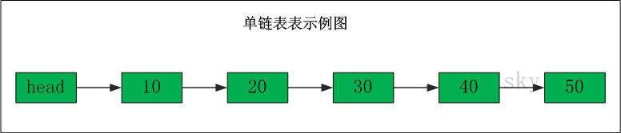

## 概要

线性表是一种线性结构，它是具有相同类型的n(n≥0)个数据元素组成的有限序列。本文先介绍线性表的几个基本组成部分：数组、单向链表、双向链表；随后给出双向链表的Java语言的实现。

文章转载自： https://www.cnblogs.com/skywang12345/p/3561803.html

## 数组

**数组**是一种最常用的线性数据结构，里面存放的元素的类型是一样的，并且有序的。

数组的特点是：数据是连续的；随机访问速度快。

对于Java而言，Collection集合中提供了ArrayList和Vector用于数组这种数据结构的实现。

## 单向链表

单向链表(单链表)是链表的一种，它由节点组成，每个节点都包含下一个节点的指针。

单链表的示意图如下：

> 表头为空，表头的后继节点是"节点10"(数据为10的节点)，"节点10"的后继节点是"节点20"(数据为10的节点)，...

### 单链表删除节点

> 删除"节点30"
> 删除之前："节点20" 的后继节点为"节点30"，而"节点30" 的后继节点为"节点40"。
> 删除之后："节点20" 的后继节点为"节点40"。

### 单链表添加节点

在"节点10"与"节点20"之间添加"节点15"
**添加之前**："节点10" 的后继节点为"节点20"。
**添加之后**："节点10" 的后继节点为"节点15"，而"节点15" 的后继节点为"节点20"。

单链表的特点是：节点的链接方向是单向的；相对于数组来说，单链表的的随机访问速度较慢，但是单链表删除/添加数据的效率很高。

## 双向链表

双向链表(双链表)是链表的一种。和单链表一样，双链表也是由节点组成，它的每个数据结点中都有两个指针，分别指向直接后继和直接前驱。所以，从双向链表中的任意一个结点开始，都可以很方便地访问它的前驱结点和后继结点。一般我们都构造双向循环链表。

双链表的示意图如下：

> 表头为空，表头的后继节点为"节点10"(数据为10的节点)；"节点10"的后继节点是"节点20"(数据为10的节点)，"节点20"的前继节点是"节点10"；"节点20"的后继节点是"节点30"，"节点30"的前继节点是"节点20"；...；末尾节点的后继节点是表头。

### 双链表删除节点

删除"节点30"
**删除之前**："节点20"的后继节点为"节点30"，"节点30" 的前继节点为"节点20"。"节点30"的后继节点为"节点40"，"节点40" 的前继节点为"节点30"。
**删除之后**："节点20"的后继节点为"节点40"，"节点40" 的前继节点为"节点20"。

### 双链表添加节点

在"节点10"与"节点20"之间添加"节点15"
**添加之前**："节点10"的后继节点为"节点20"，"节点20" 的前继节点为"节点10"。
**添加之后**："节点10"的后继节点为"节点15"，"节点15" 的前继节点为"节点10"。"节点15"的后继节点为"节点20"，"节点20" 的前继节点为"节点15"。

