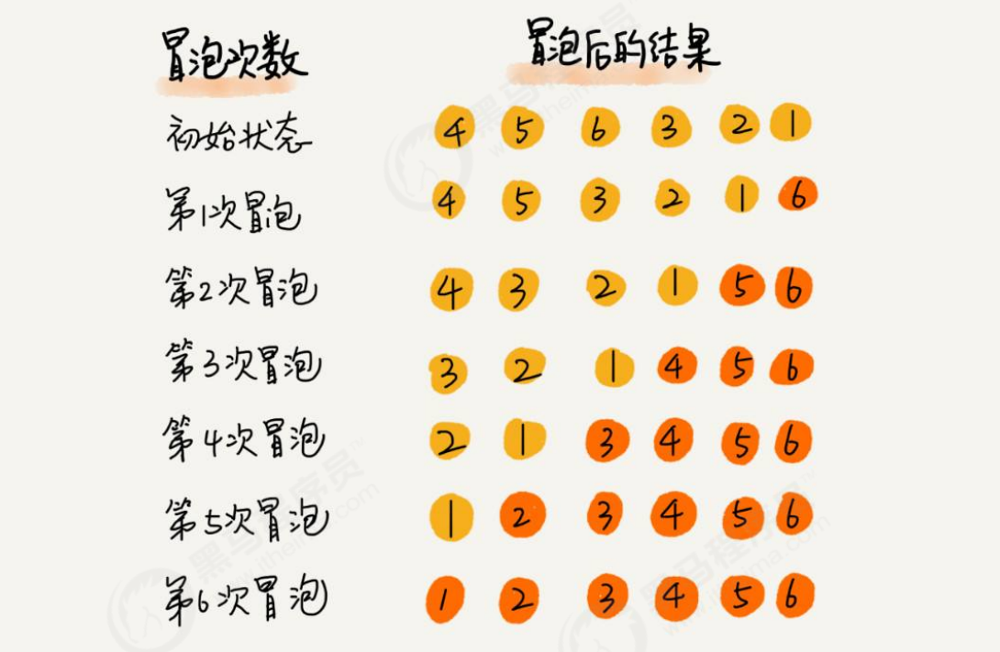
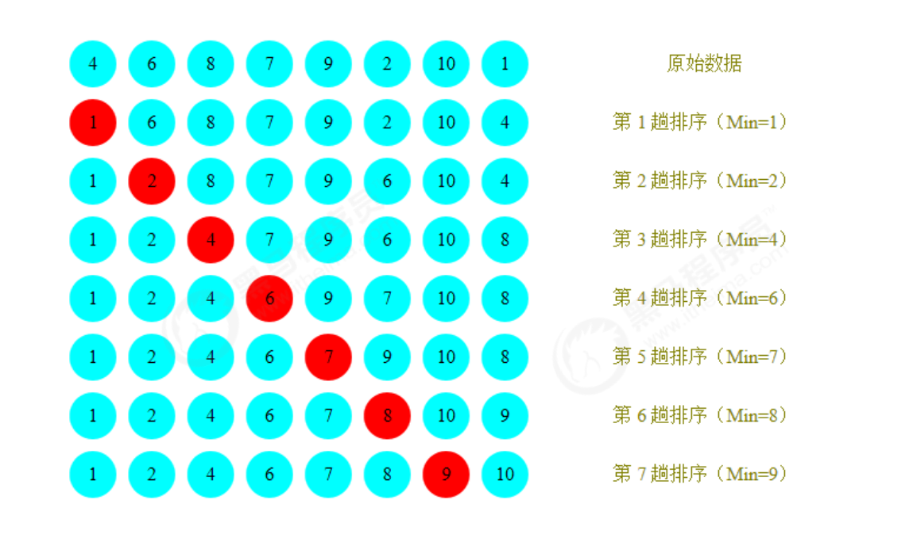
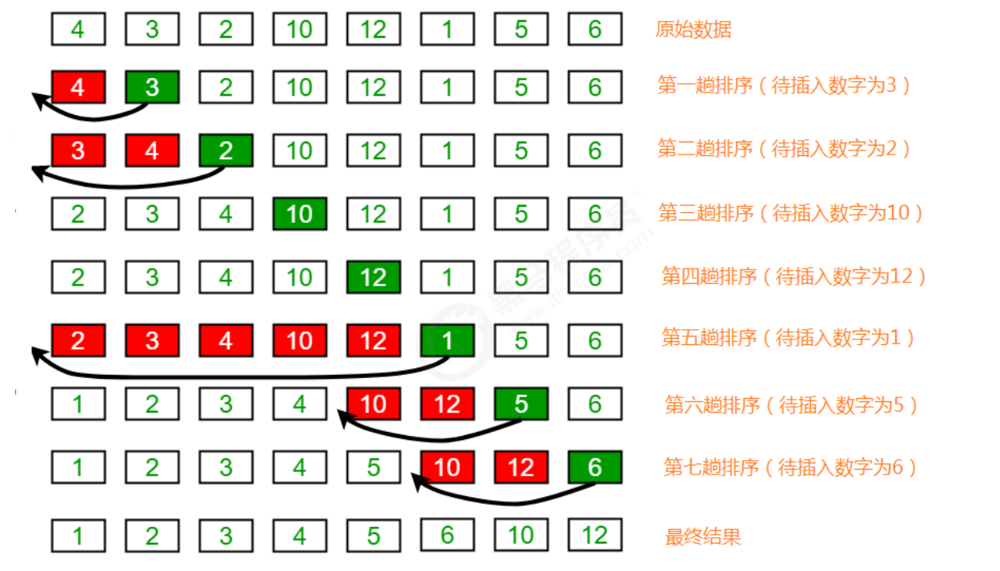
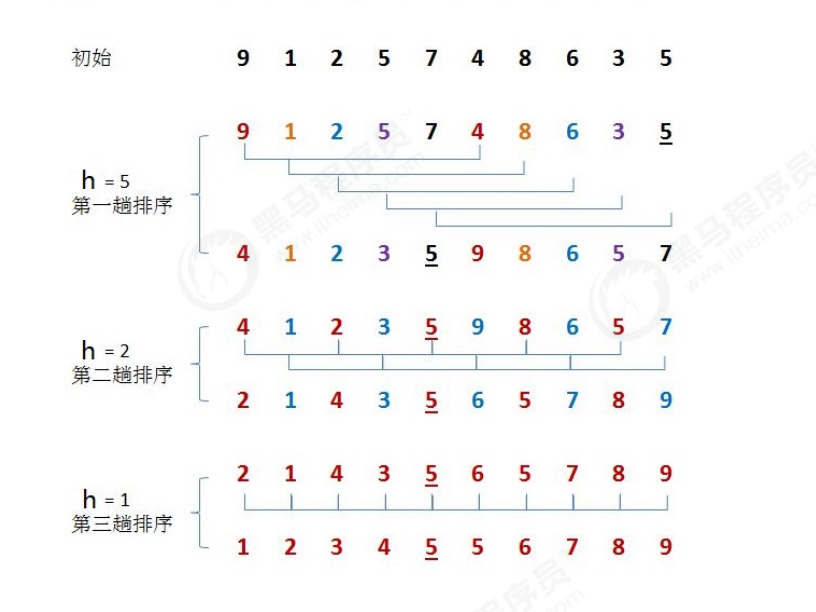

# 排序算法
## Comparable

Comparable表示可被排序的，实现该接口的类的对象自动拥有排序功能。

Comparable的中文意思就是可被排序的，代表本身支持排序功能。只要我们的类实现了这个接口，那么这个类的对象就会自动拥有了可被排序的能力。而且这个排序被称为类的**自然顺序**。这个类的对象的列表可以被`Collections.sort` 和 `Arrays.sort` 来执行排序。同时这个类的实例具备作为`sorted map ` 的key和 `sorted set `的元素的资格。

建议（虽然不是必需的）最好使自然排序与 equals 一致。这是因为在使用自然排序与 equals 不一致的元素（或键）时，没有显式比较器的有序集合（和有序映射表）行为表现“怪异”。尤其是，这样的有序集合（或有序映射表）违背了根据 equals 方法定义的集合（或映射表）的常规协定。

例如，如果将两个键 a 和 b 添加到没有使用显式比较器的有序集合中，使 (!a.equals(b) && a.compareTo(b) == 0)，那么第二个 add 操作将返回 false（有序集合的大小没有增加），因为从有序集合的角度来看，a 和 b 是相等的。

实际上，所有实现 Comparable 的 Java 核心类都具有与 equals 一致的自然排序。java.math.BigDecimal 是个例外，它的自然排序将值相等但精确度不同的 BigDecimal 对象（比如 4.0 和 4.00）视为相等。

### 源码

```java
public interface Comparable<T> {
    public int compareTo(T o);
}
```

该接口只有一个抽象方法 `compareTo`，这个方法主要就是为了定义我们的类所要排序的方式。`compareTo`方法用于比较当前元素a与指定元素b，结果为 int 值:

- 如果a > b，int>0；
- 如果a=b，int=0；
- 如果a<b，int<0。

### 需求

1. 定义一个学生类Student，具有年龄age和姓名username两个属性，并通过Comparable接口提供比较规则.
2. 定义测试类Test，在测试类Test中定义测试方法Comparable getMax(Comparable c1,Comparable c2)完成测试。

```java
package it.hanliukui;

/**
 * @Author hanliukui
 * @Date 2021/11/21 13:37
 * @Description xxx
 */
public class ComparableTest {

    public static void main(String[] args) {
        // 测试
        Student a = new Student("张三",22);
        Student b = new Student("李四",23);
        Comparable max = getMax(a, b);
        System.out.println(max);
    }


    /**
     * 获取两个元素中最大的那个元素
     * @param a 元素a
     * @param b 元素b
     * @return
     */
    private static Comparable getMax(Comparable a,Comparable b){
        int i = a.compareTo(b);
        if (i>0){
            return a;
        }
        return b;
    }
}

class Student implements Comparable<Student>{
    private String username;
    private int age;

    public Student() {
    }

    public Student(String username, int age) {
        this.username = username;
        this.age = age;
    }

    public String getUsername() {
        return username;
    }

    public void setUsername(String username) {
        this.username = username;
    }

    public int getAge() {
        return age;
    }

    public void setAge(int age) {
        this.age = age;
    }

    @Override
    public String toString() {
        return "Student{" +
                "username='" + username + '\'' +
                ", age=" + age +
                '}';
    }

    // 定义比较规则
    @Override
    public int compareTo(Student o) {
        return this.getAge() - o.getAge();
    }
}

```


## 冒泡排序

冒泡排序是一种简单的排序算法。它重复地走访过要排序的数列，一次比较两个元素，如果它们的顺序错误就把它们交换过来。

走访数列的工作是重复地进行直到没有再需要交换，也就是说该数列已经排序完成。这个算法的名字由来是因为越小（大）的元素会经由交换慢慢“浮”到数列的顶端。 

### 算法描述

以下描述的出发点是按从小到大排序：

1. 比较相邻的元素。如果第一个比第二个大，就交换它们两个；
2. 对每一对相邻元素做同样的工作，从开始第一对元素到结尾的最后一对元素。最终最后位置的元素就是最大
   值；
3. 重复以上的步骤；


### 举例

排序前：{4,5,6,3,2,1}

排序后：{1,2,3,4,5,6}



### 代码实现

```java
package it.hanliukui;

import java.util.Arrays;

/**
 * @Author hanliukui
 * @Date 2021/11/21 14:13
 * @Description xxx
 */
public class BubbleSortTest {

    public static void main(String[] args) {
        Integer[] arr = {4,5,6,3,2,1};
        // 冒泡排序
        BubbleSort.sort(arr);
        System.out.println(Arrays.toString(arr));
    }
}

class BubbleSort{

    /**
     * 排序
     * @param arr 待排序的数组元素
     */
    public static void sort(Comparable[] arr){

        for (int i= arr.length-1;i>0;i--){
            for (int j=0;j<i;j++){
                if (greater(arr[j],arr[j+1])){
                    exchange(arr,j,j+1);
                }
            }
        }
    }

    /**
     * 比较两元素大小
     * @param a 元素 a
     * @param b 元素 b
     * @return 比较结果值
     */
    private static boolean greater(Comparable a, Comparable b){
        return a.compareTo(b)>0;
    }

    /**
     * 交换元素位置
     * @param arr 元素数组
     * @param i 元素位置索引
     * @param j 元素位置索引
     */
    private static void exchange(Comparable[] arr,int i,int j){
        Comparable temp = arr[i];
        arr[i] = arr[j];
        arr[j] = temp;
    }
}

```

### 时间复杂度分析

冒泡排序使用了双层for循环。在最坏情况下，也就是假如要排序的元素为{6,5,4,3,2,1}逆序，那么：
元素比较的次数为：

```
(N-1)+(N-2)+(N-3)+...+2+1=((N-1)+1)*(N-1)/2=N^2/2-N/2;
```

元素交换的次数为：

```
(N-1)+(N-2)+(N-3)+...+2+1=((N-1)+1)*(N-1)/2=N^2/2-N/2;
```

总执行次数为：

```
(N^2/2-N/2)+(N^2/2-N/2)=N^2-N;
```

按照大O推导法则，保留函数中的最高阶项那么最终冒泡排序的时间复杂度为O(N^2)。

## 选择排序

选择排序(Selection-sort) 是一种简单直观的排序算法。它的工作原理：首先在未排序序列中找到最小（大）元素，存放到排序序列的起始位置，然后，再从剩余未排序元素中继续寻找最小（大）元素，然后放到已排序序列的末尾。以此类推，直到所有元素均排序完毕。 

### 算法描述

n个记录的直接选择排序可经过n-1趟直接选择排序得到有序结果。具体算法描述如下：

- 初始状态：无序区为R[1..n]，有序区为空；
- 第i趟排序(i=1,2,3…n-1)开始时，当前有序区和无序区分别为R[1..i-1]和R(i..n）。该趟排序从当前无序区中-选出关键字最小的记录 R[k]，将它与无序区的第1个记录R交换，使R[1..i]和R[i+1..n)分别变为记录个数增加1个的新有序区和记录个数减少1个的新无序区；
- n-1趟结束，数组有序化了。


### 举例

排序前：{4,6,8,7,9,2,10,1}
排序后：{1,2,4,5,7,8,9,10}



### 代码实现

```java
package it.hanliukui;

import java.util.Arrays;

/**
 * @Author hanliukui
 * @Date 2021/11/21 14:51
 * @Description xxx
 */
public class SelectionSortTest {

    public static void main(String[] args) {
        Integer[] arr = {4,6,8,7,9,2,10,1};
        SelectionSort.sort(arr);
        System.out.println(Arrays.toString(arr));
    }
}

/**
 * 选择排序
 *
 */
class SelectionSort{

    /**
     * 选择排序
     * @param arr 待排序的数组元素
     */
    public static void sort(Comparable[] arr){
        for (int i=0;i< arr.length;i++){
            // 记录未排序组当前最小值位置索引
            int index = i;
            for (int j = i;j< arr.length;j++){
                if (greater(arr[index],arr[j])){
                    index = j;
                }
            }
            exchange(arr,index,i);
        }
    }

    /**
     * 比较两元素大小
     * @param a 元素 a
     * @param b 元素 b
     * @return 比较结果值
     */
    private static boolean greater(Comparable a, Comparable b){
        return a.compareTo(b)>0;
    }

    /**
     * 交换元素位置
     * @param arr 元素数组
     * @param i 元素位置索引
     * @param j 元素位置索引
     */
    private static void exchange(Comparable[] arr,int i,int j){
        Comparable temp = arr[i];
        arr[i] = arr[j];
        arr[j] = temp;
    }

}

```

## 插入排序

插入排序（Insertion sort）是一种简单直观且稳定的排序算法。它的工作原理是通过构建有序序列，对于未排序数据，在已排序序列中从后向前扫描，找到相应位置并插入。

插入排序的工作方式非常像人们排序一手扑克牌一样。开始时，我们的左手为空并且桌子上的牌面朝下。然后，我们每次从桌子上拿走一张牌并将它插入左手中正确的位置。为了找到一张牌的正确位置，我们从右到左将它与已在手中的每张牌进行比较。

###  算法描述

一般来说，插入排序都采用in-place在数组上实现。具体算法描述如下：

1. 从第一个元素开始，该元素可以认为已经被排序；
2. 取出下一个元素，在已经排序的元素序列中从后向前扫描；
3. 如果新元素（已排序）大于新元素，将该元素移到下一位置；
4. 重复步骤3，直到找到已排序的元素小于或者等于新元素的位置；
5. 将新元素插入到该位置后；
6. 重复步骤2~5。


### 举例

- 排序前：{4,3,2,10,12,1,5,6}
- 排序后：{1,2,3,4,5,6,10,12}




### 代码实现

```java
package it.hanliukui;

import java.util.Arrays;

/**
 * @Author hanliukui
 * @Date 2021/11/21 15:06
 * @Description xxx
 */
public class InsertionSortTest {
    public static void main(String[] args) {
        Integer[] arr = {4,3,2,10,12,1,5,6};
        InsertionSort.sort(arr);
        System.out.println(Arrays.toString(arr));
    }
}

class InsertionSort{

    /**
     * 插入排序
     * @param arr 待排序的数组元素
     */
    public static void sort(Comparable[] arr){
        for (int i=1;i< arr.length;i++){
            // 当前元素为a[i],依次和i前面的元素比较，找到一个小于等于a[i]的元素
            for (int j=i;j>0;j--){
                if (greater(arr[j-1],arr[j])){
                    exchange(arr,j-1,j);
                }else {
                    break;
                }
            }
        }
    }

    /**
     * 比较两元素大小
     * @param a 元素 a
     * @param b 元素 b
     * @return 比较结果值
     */
    private static boolean greater(Comparable a, Comparable b){
        return a.compareTo(b)>0;
    }

    /**
     * 交换元素位置
     * @param arr 元素数组
     * @param i 元素位置索引
     * @param j 元素位置索引
     */
    private static void exchange(Comparable[] arr,int i,int j){
        Comparable temp = arr[i];
        arr[i] = arr[j];
        arr[j] = temp;
    }

}

```

### 时间复杂度分析

插入排序使用了双层for循环，其中内层循环的循环体是真正完成排序的代码。最坏情况，也就是待排序的数组元素为{12,10,6,5,4,3,2,1}，那么：

比较的次数为：

```
1+2+3+...+(N-3)+(N-2)+(N-1) = ((N-1)+1)*(N-1)/2=N^2/2-N/2;
```

交换的次数为：

```
1+2+3+...+(N-3)+(N-2)+(N-1) = ((N-1)+1)*(N-1)/2=N^2/2-N/2;
```

总执行次数为：

```
(N^2/2-N/2)+(N^2/2-N/2)=N^2-N;
```

按照大O推导法则，保留函数中的最高阶项那么最终插入排序的时间复杂度为O(N^2)。

## 希尔排序

1959 年 Shell 发明，第一个突破 O(n2) 的排序算法，是简单插入排序的改进版。希尔排序是插入排序的一种，又称“缩小增量排序”。

### 排序原理

1.选定一个增长量h，按照增长量h作为数据分组的依据，对数据进行分组；
2.对分好组的每一组数据完成插入排序；
3.减小增长量，最小减为1，重复第二步操作。


在希尔排序中，增长量h并没有固定的规则，有很多论文研究了各种不同的递增序列，但都无法证明某个序列是最
好的。

### 举例

排序前：{9,1,2,5,7,4,8,6,3,5}
排序后：{1,2,3,4,5,5,6,7,8,9}



### 代码实现

增长量h的确定：增长量h的值无固定的规则，我们这里采用以下规则：

```java
int h=1;
while(h<N){
	h=2h+1；//3,7
}
//循环结束后我们就可以确定h的最大值；N为数组长度
h的减小规则为：
h=h/2
```

```java
package it.hanliukui;

import java.util.Arrays;

/**
 * @Author hanliukui
 * @Date 2021/11/21 16:22
 * @Description xxx
 */
public class ShellSortTest {

    public static void main(String[] args) {
        Integer[] arr = {9,1,2,5,7,4,8,6,3,5};
        ShellSort.sort(arr);
        System.out.println(Arrays.toString(arr));
    }
}

/**
 * 希尔排序
 */
class ShellSort{

    public static void sort(Comparable[] arr){
       int N = arr.length;

        //确定增长量h的最大值
       int h =1;
       while (h<N/2){
           h = 2*h+1;
       }

       //当增长量h小于1，排序结束
       while (h>=1) {
           for (int i = h; i < arr.length; i++) {

               //a[i]就是待插入的元素
               //把a[i]插入到a[i-h],a[i-2h],a[i-3h]...序列中
               for (int j = i; j >= h; j -= h) {
                   //a[j]就是待插入元素，依次和a[j-h],a[j-2h],a[j-3h]进行比较，如果a[j]小，那么交换位置，如果不小于，a[j]大，则插入完成。
                   if (greater(arr[j-h], arr[j])) {
                       exchange(arr, j, j-h);
                   }else {
                       break;
                   }
               }
           }

           h = h/2;
       }
    }

    /**
     * 比较两元素大小
     * @param a 元素 a
     * @param b 元素 b
     * @return 比较结果值
     */
    private static boolean greater(Comparable a, Comparable b){
        return a.compareTo(b)>0;
    }

    /**
     * 交换元素位置
     * @param arr 元素数组
     * @param i 元素位置索引
     * @param j 元素位置索引
     */
    private static void exchange(Comparable[] arr,int i,int j){
        Comparable temp = arr[i];
        arr[i] = arr[j];
        arr[j] = temp;
    }

}


```


## 归并排序


## 快速排序